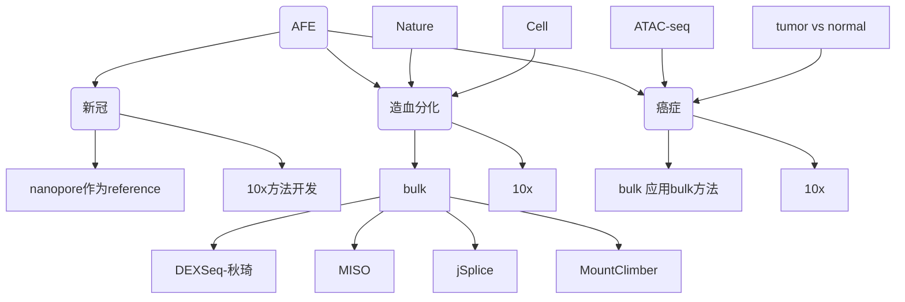

# AFE
毕业课题的AFE项目

```mermaid
graph TD
	A(AFE) --> B(新冠)
	
	B --> B1[nanopore作为reference]
	B --> B2[10x方法开发]
	
	A --> C(造血分化)
	
	data3[Nature] --> C
	data4[Cell] --> C
	
	C --> C1[bulk]
	C --> C2[10x]
	
	C1  --> C11[DEXSeq-秋琦]
	C1 --> C12[MISO]
	C1 --> C13[jSplice]
	C1 --> C14[MountClimber]
	
	A --> D(癌症)
	
	data1[ATAC-seq] --> D
	data2[tumor vs normal] --> D
	
	D --> D1[bulk 应用bulk方法]
	D --> D2[10x]
```

### 测试数据

/mnt/raid64/BetaCoV_sc/Coivd19_amit/cellranger/package
